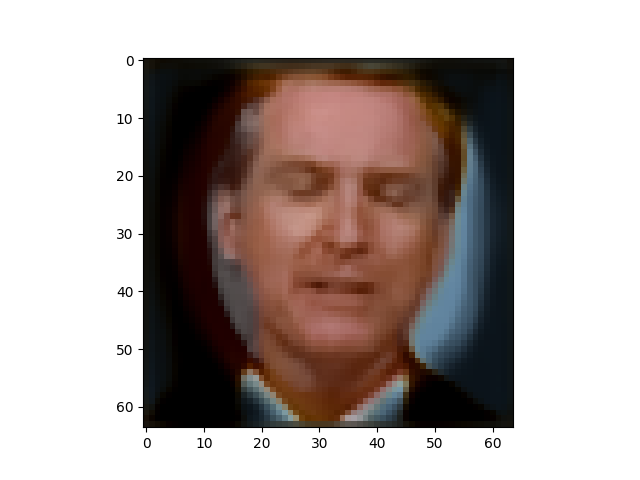
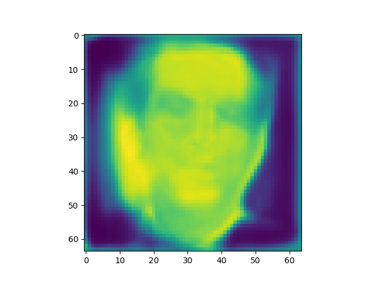
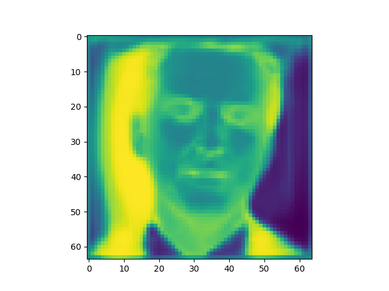

# BioFaceNet

## Instructions

Pytorch Implentation of BioFaceNet: Deep Biophysical FaceImage Interpretation

The code is mostly located in CNN.ipynb

The training code is also downloaded to cnn.py for training without using the notebook.

My data can be downloaded from here:

https://drive.google.com/file/d/1--7kZSMii5rhZEuiM1Wk3IawkVVs_BlB/view?usp=sharing

This should be put in a folder lableled data to run the training script.

Or the original data can be downloaded from here: https://drive.google.com/drive/folders/1UMiaw36z2E1F-tUBSMKNAjpx0o2TePvF
and placed in the data_creation folder. Then the python notebook in data_creation would need to be run to create the data.

A pretrained model can be downloaded form here:
https://drive.google.com/drive/folders/1-4SxpdDGHw6gNng1rWBDEknBv7F7Tarp?usp=sharing

model_v3.pth has was trained with a higher specularity loss, whereas model.pth was trained with a lower specularity loss. These should be put in folder called "working".

## Usage

python3 cnn.py [--weights path/to/model/weights] [--cuda]

python3 test.py path/to/model/weights path/to/images.hdf5 [--cuda]

## Detailed Analysis and Improvements

This is all in CNN.ipynb file.

## Results

Here is an example of the network on an example image from the validation set

Original

Reconstruction

Shading

Specular

Blood

Melanin

More results provided in results folder.

This is a set of training + validation data.

## Video-Results

The file video_prediction.py runs the model on a sample video and
outputs to video-results

Original

Reconstruction

Shading

Specular

Blood

Melanin

More results provided in results folder.

This is a set of training + validation data.
